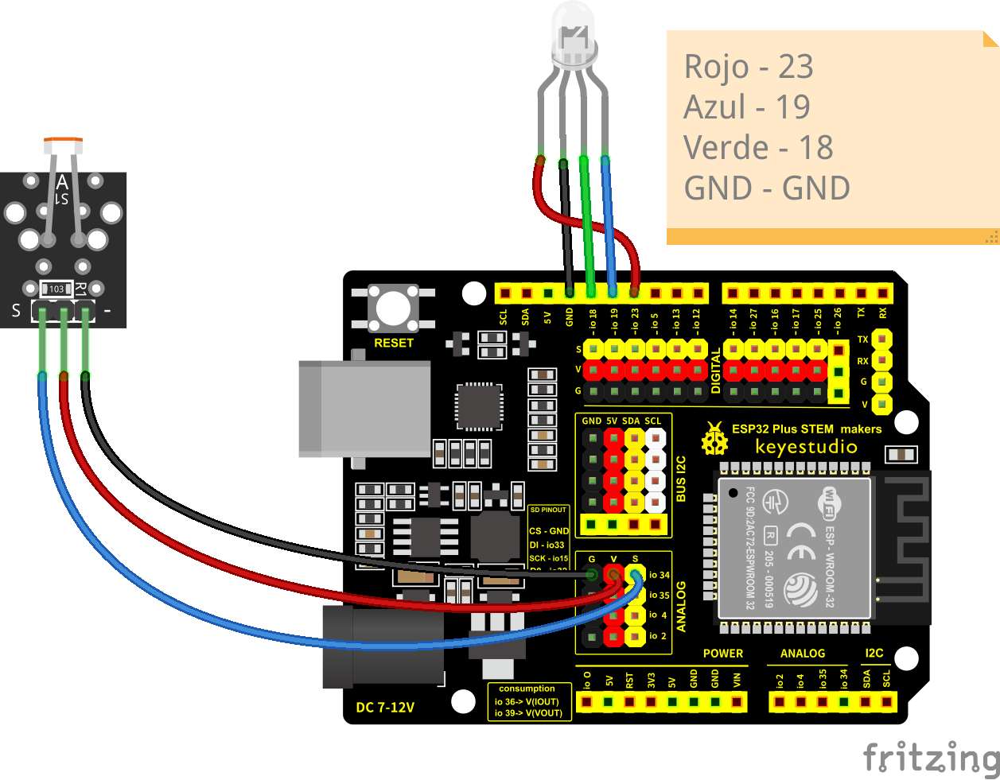
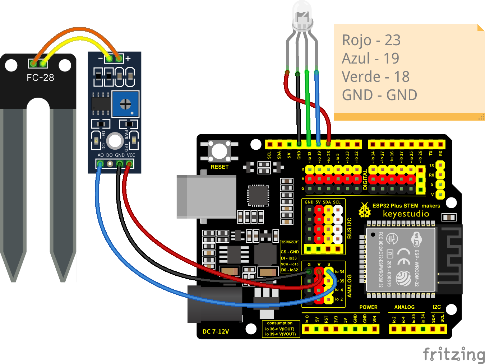
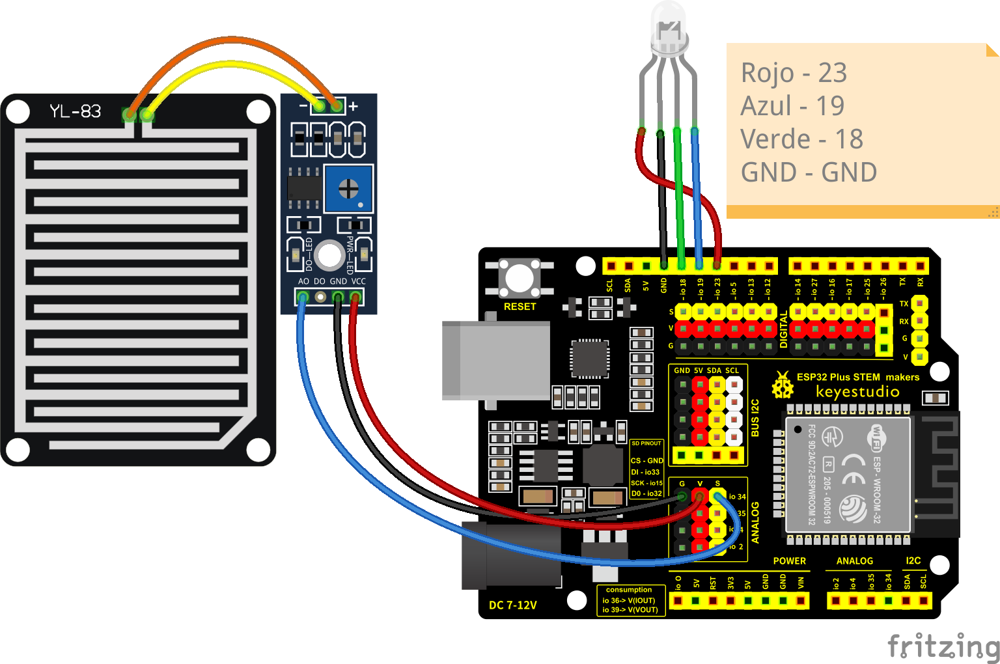
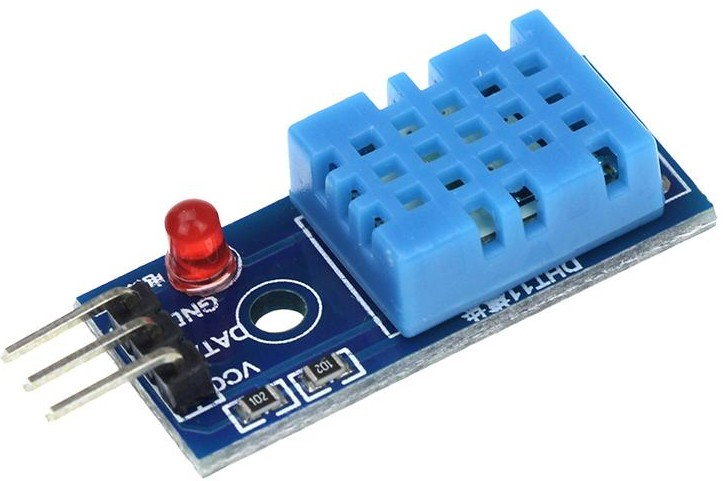
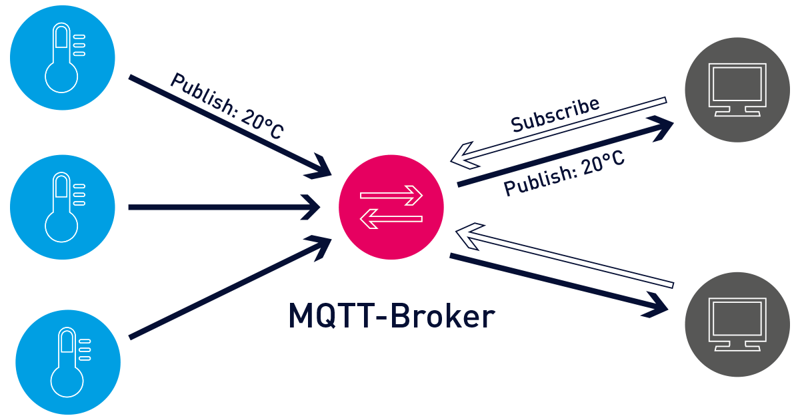

# Proyecto

Vamos a trabajar conceptos de agricultura de precisión:

* Medida del estado del terreno utilizando sensores: humedad, temperatura, ph
* Control de riego, administración precisa de productos fitosanitarios, abonos, ...
* Control del estado del terreno y de las plantas utilizando fotografía por drones
* [Agrivoltaica](./Agrivoltaica.md)


## Hardware

## ESP32 Plus STEAMakers

Esta placa [ESP32 STEAMAKERS](https://tienda.bricogeek.com/arduino-compatibles/1705-esp32-steamakers.html) es una versión muy completa de las ESP32 que conocemos.

Tiene formato Arduino UNO para así poder usar los shields/escudos que ya tengamos.

Además incluye un conector para tarjeta SD y permite medir su propio consumo.

Como vemos en las imágenes, dispone de conexión sencilla para sensores de tres pines.


Además se han desdoblado los pines I2C para facilitar la conexión de los dispositivos I2C cada vez más frecuentes.


### Características


Las características más importantes de esta placa son:

* Microcontrolador Tensilica Xtensa 32-bit LX6 a 160MHz.
* Conectividad Wifi 802.11 b/g/n/e/i.
* Conectividad Bluetooth 4.2 y modo BLE.
* Zócalo para tarjetas µSD.
* 14 entradas y salidas digitales con alimentación.
* Conector serie hembra con alimentación.
* Conector I2C para conectar hasta 5 dispositivos a la vez sobre la misma
placa.
* Conector hembra I2C para conexión de una pantalla OLED.
* Conector de Reset.
* Conector de 5V
* Conector de 3.3V
* Interruptor 3.3-5V seleccionable para cambiar entre estas dos tensiones
en algunos pines de alimentación.
* Entradas y salidas analógicas.
* Sensor Hall y de temperatura integrado.
* 2 convertidores Digital-Analógico (DAC) de 8 bits.
* 16 convertidores Analógico-Digital (ADC) de 12 bits.
* 16 canales PWM.
* 2 UART.
* 2 canales I2C.
* 4 canales SPI.
* 448Kb ROM.
* 520 KB SRAM.
* 8KB+8KB SRAM en RTC.
* 1kbit eFUSE.
* 512 bytes Memoria Flash (EEPROM).
* 10 sensores táctiles.
* 4 temporizadores internos de 64 bits.


Incluye un ACS712 conectado a los pines io39 para medida de voltaje e io36 para intensidad y así poder determinar el consumo en cada momento.

### Herramientas de programación

Comenzaremos usando [ArduinoBlocks.com](http://www.arduinoblocks.com): una herramienta de programación con bloques ideal para iniciarse.

Instalamos [ArduinoBlock Connector](http://www.arduinoblocks.com/web/site/abconnector5)


[Creamos nuestra cuenta](http://www.arduinoblocks.com/web/site/register)


## Creando proyectos

Creamos proyecto personal con la placa ESP32 STEAMakers


Documentaremos la descripción del proyecto y los componentes que vamos a usar

## LED 

Conectamos un led RGB 


[Led 19 Steamakers](http://www.arduinoblocks.com/web/project/1014904)


## Controlando el brillo de un led

Vamos a controlar ahora el brillo de un led analógicamente

Además vamos a enviar datos a la consola

[led 19 PWM](http://www.arduinoblocks.com/web/project/1014903)


Activamos la consola, seleccionamos la velocidad adecuada y pulsamos "Conectar"


## LED RGB

Son 3 leds de colores Rojo, Azul y Verde en un único encapsulado, con una de las patillas conectadas, en nuestro caso es el pin negativo. Deberíamos conectar unas resistencias en serie para limitar la cantidad de corriente y el voltaje que llega al led.


Podemos crear colores combinando el brillo de cada uno


## Led RGB con función

Para controlar mejor el color del led vamos a crear una función, que es una manera de reutilizar nuestro código muchas veces de manera sencilla


[Proyecto: led RGB con función](http://www.arduinoblocks.com/web/project/782650)


## Sensores


### Resistencia sensible a la luz o LDR


Se trata de una resistencia cuyo valor cambia dependiendo de la cantidad de luz que reciba o **LDR**, se la suele llamar también célula fotoeléctrica y se usa en multitud de lugares, como sensores de paso, activación de luces automática,...



El montaje requiere de un divisor de tensión, que es una resistencia que equilibra el valor de la LDR para facilitar la medida en el punto medio. La resistencia debe tener un valor similar al del LDR.

Para determinar su rango o el umbral deberemos medir los valores que obtenemos en las condiciones reales.


[Programa: LDR](http://www.arduinoblocks.com/web/project/1014906)

### Sensor de humedad de suelo




Este sensor mide la conductividad del suelo, lo que suele ser proporcional a la humedad de este.

Mediremos los valores del suelo seco y con el nivel de humedad que deseamos para determinar el umbral.


[Programa: humedad](http://www.arduinoblocks.com/web/project/1014907)

### Sensor de nivel de agua




Es un típico sensor que nos permite medir el nivel de agua de un depósito.

## Sensores DHT

La familia de sensores DHT está formada por sensores de **temperatura** y **humedad** de bajo coste y que se usan en multitud de dispositivos. Tienen un característico encapsulado de plástico, de diferente color según los modelos. Los diferentes sensores de la familia tienen diferente  precisión a la hora de medir.

Todos tienen en común que para comunicarse utilizan un protocolo digital (un lenguaje digital de 1 y 0, organizados de una manera concreta en el tiempo.), y requieren de un único pin digital. 

Para comunicarnos con ellos necesitaremos un módulo que implemente este protocolo de comunicaciones.

También es algo característico que tiene 4 patillas pero que sólo usaremos 3 de ellas: Vcc, GND y Data.

Podemos alimentarlos entre 3 y 5V.

No podemos medir demasiado rápido con ellos, recomendándose que se deje al menos 1 segundo entre medidas.


El DHT22 (también llamado AM2302) tiene una resolución aproximada de 0.5º al medir temperatura y del 2% en la humedad, como podemos ver en su [hoja de datos](https://www.sparkfun.com/datasheets/Sensors/Temperature/DHT22.pdf) (datasheet)


El DHT11 tiene una resolución aproximada de 2º para la temperatura y 5% en la humedad, como podemos ver en su [hoja de datos](https://www.mouser.com/datasheet/2/758/DHT11-Technical-Data-Sheet-Translated-Version-1143054.pdf)

Los podemos encontrar en formato módulo donde el fabricante suele incorporar una resistencia que mejora la calidad de la comunicación, sólo añade 3 terminales externos y añade los nombre de las patillas:




Cuando los compremos debemos asegurarnos de conocer cual es cada patilla, puesto que distintos fabricantes no respetan la misma disposición de los terminales. 

Si no respetamos la polaridad en la alimentación no sólo no funcionan, sino que se queman y quedan inservibles.

Vamos a hacer un sencillo montaje


El programa:


[Programa: DHT](http://www.arduinoblocks.com/web/project/1014908)

Si vemos que se producen errores:


[Programa v2: DHT11](http://www.arduinoblocks.com/web/project/1014909)

### Relé


1. ¿Qué es un **relé**? un relé es un interruptor eléctrico que podemos accionar electrónicamente con una pequeña corriente y que funciona casi siempre electromecánicamente (un electroimán que atrae un contacto eléctrico) de ahí el 'clic-clic' que hacen al funcionar. 

1. Uso: los usaremos para controlar dispositivos que necesitan más potencia  que nuestra placa y/o que funcionan a mayores voltajes.
1. Control: para activar/desactivar los relés sólo tenemos que activar/desactivar el pin de nuestra placa al que está conectado
1. Alimentación y Consumo: el control de varios relés requiere de una mayor potencia de la que puede suministrar el puerto USB, por lo que usaremos un alimentación más potente si es posible.
1. Puesto que las señales de control de las placas son de 3.3V pudiera ser que algunos relés no se activen correctamente, aunque la mayoría sí. Lo que es importante es que alimentemos el relé (patilla V o Vcc) con 5V.

## Controlando relés

Una aplicación directa de lo que hemos visto activando leds, puede ser controlar un módulo con varios relés al mismo tiempo.


Como hemos dicho, un relé es un dispositivo que nos permite controlar un dispositivo conectado a la corriente con una salida de nuestro dispositivo y sus modestos 5 voltios. Es decir, el relé actúa como un interruptor electrónico y al activar la patilla que lo controla se cierra el contacto que deja pasar la corriente al dispositivo


En el montaje del ejemplo vemos como el relé 1 actúa como interruptor del circuito de alimentación de la bombilla. Al activar la salida 18, que controla el relé 1 (por estar conectada a IN1) cerrará la salida del relé y la alimentación llegará a la bombilla. Podemos poner la alimentación desde un enchufe o desde cualquier otra fuente de alimentación. Los relés funcionan como un interruptor eléctrico.


Los dos circuitos eléctricos, de alta potencia (el motor) y el de baja potencia (la placa) están aislados entre sí. No obstante **hay que tener cuidado al manejar la parte de alto voltaje/potencia**


```python
import machine

pin_reles = (18,19,23,5)
reles = []
for pin in pin_reles:
    rele = machine.Pin(pin,machine.Pin.OUT)
    reles.append(rele)

reles[0].on() # Encendemos la bombilla

reles[0].off() # Apagamos la bombilla


reles[2].on() # Encendemos el relé 2
```
Y con esto ya estamos abriendo la puerta a la domótica...

Hay que comentar que algunos relés tienen lógica invertida, es decir, cuando activamos la correspondiente entrada Inx se desactiva el relé y al revés. Suelen indicarse como "Relés de activación de nivel (trigger) bajo".

## Termostatos

## Iluminación automática

## Motores/Bombas

## Sistema de riego

Versiones:

* Tiempo
* Humedad del suelo
* Humedad y lluvia


## Control de nivel de depósito

## 

## Alimentación solar

### IOT

¿Qué es IOT?


### MQTT

¿Qué es MQTT?




### Publicación en Adafruit IO


[Publicación de la Acceleración en adafruit.IO con MQTT](http://www.arduinoblocks.com/web/project/782713)

### Medida de humedad y temperatura

Vamos a medir ahora la temperatura, la presión y la humedad usando un sensor BME280, que conectamos también por I2C, en este caso de la siguiente manera, conectando SDA al pin SDI del sensor y SCL al SCK del sensor


Desgraciadamente, arduinoBlocks no dispone de bloque para el sensor BME280, por eso vamos a usar el código de [ejemplo](./codigo/test_BME280/test_BME280.ino) de la librería Adafruit BME280 desde el Gestor de librerías (Programa->Librerías->Administrador de librerías) de [Arduino IDE](https://arduino.cc/software)

Al conectar el sensor y subir el código obtendremos valores bastante precisos:


    Temperature = 22.58 °C
    Pressure = 933.06 hPa
    Approx. Altitude = 690.11 m
    Humidity = 53.76 %


## Pantalla

Conexión SPI:


Necesitamos instalar las librerías "adafruit ST7778" y usaremos uno de [sus ejemplos](./codigo/test_ST7789/test_ST7789.ino) para probar que funciona

```C++
#include <Adafruit_GFX.h>    // Core graphics library
#include <Adafruit_ST7735.h> // Hardware-specific library for ST7735
#include <Adafruit_ST7789.h> // Hardware-specific library for ST7789
#include <SPI.h>


#define TFT_CS         14
#define TFT_RST        15
#define TFT_DC         4

// For 1.14", 1.3", 1.54", 1.69", and 2.0" TFT with ST7789:
Adafruit_ST7789 tft = Adafruit_ST7789(TFT_CS, TFT_DC, TFT_RST);


void setup(void) {
  Serial.begin(115200);
  Serial.print("Temperatura, presion y humedad");

  // OR use this initializer (uncomment) if using a 1.14" 240x135 TFT:
  tft.init(135, 240);           // Init ST7789 240x135
  
  Serial.println(F("Initializada"));

  uint16_t time = millis();
  tft.fillScreen(ST77XX_BLACK);
  time = millis() - time;

  Serial.println(time);
  
}

int counter = 10;
void loop() {
  tft.fillScreen(ST77XX_BLACK);
  tft.setCursor(0, 0);
  tft.setTextColor(ST77XX_BLUE);
  tft.setTextSize(4);
  tft.print(counter++);
  delay(10);
}

```