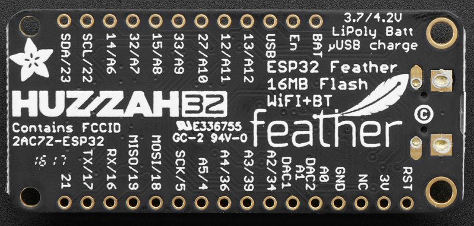

# Proyecto

Vamos a medir la posición 3D de una persona con un acelerómetro y generaremos una alarma cuando esta posisición sea una determinada


## Hardware

### MCU/SOC

[Adafruit HUZZAH32 - ESP32 Feather](https://tienda.bricogeek.com/placas-adafruit-feather/1108-adafruit-huzzah32-esp32-feather.html) [(Details)](https://learn.adafruit.com/adafruit-huzzah32-esp32-feather?view=all)




* 240 MHz dual core Tensilica LX6 microcontroller with 600 DMIPS
* 520 KB SRAM
* 802.11b/g/n HT40 Wi-Fi t
* Dual mode Bluetooth (classic and BLE)
* 4 MByte flash
* Hall sensor
* 10x capacitive touch interface
* 3 x UARTs 
* 3 x SPI 
* 2 x I2C 
* 12 x ADC de 12 bits
* 2 x I2S for Audio
* 2 x DAC de 10 bits

Conector JST para batería lipo, con cargador incorporado

Podemos leer el valor de la batería en A13/35. Debemos multiplicar por 2 el valor leído


Debemos soldar los pines


## [Acelerómetro 3 ejes adxl345](https://tienda.bricogeek.com/acelerometros/1158-acelerometro-3-ejes-adxl345-2g4g8g16g.html) [(Details)](https://www.adafruit.com/product/1231#technical-details)


* Sensor Analog Devices ADXL 345
* Alimentación: 3.3 a 5V
* Comunicación: I2C o SPI
* Sensibilidad configurable: +-2g/4g/8g/16g

## [Sensor de temperatura, humedad y presión BME280](https://tienda.bricogeek.com/sensores-temperatura/1116-sensor-de-temperatura-humedad-y-presion-bme280.html)[(Details)](https://www.adafruit.com/product/2652)


* Sensor: Bosh BME280
* Temperatura: +/- 1Cº
* Humedad: +/- 3%
* Presión: +/- 1 hPa
* Alimentación: 3.3 a 5V
* Comunicación: I2C o SPI

## [Pantalla TFT color 1.14' 240x135 - ST7789](https://tienda.bricogeek.com/pantallas-lcd/1372-pantalla-tft-color-114-240x135-st7789.html) [(Details)](https://www.adafruit.com/product/4383)


* Tipo: TFT IPS
* Chip: ST7789
* Resolución: 240x135 píxeles (260ppi)
* Diagonal: 1.14 pulgadas
* Alimentación: 3.3 - 5V
* Interfaz: SPI
* Zócalo para tarjeta MicroSD

### Herramientas de programación

Comenzaremos usando [ArduinoBlocks.com](http://www.arduinoblocks.com): una herramienta de programación con bloques ideal para iniciarse.

Instalamos [ArduinoBlock Connector](http://www.arduinoblocks.com/web/site/abconnector5)


[Creamos nuestra cuenta](http://www.arduinoblocks.com/web/site/register)


## Led de la placa

La placa tiene incluido un led conectado al pin 13 que encenderemos y apagaremos cada cierto tiempo


[Led 13 Adafruit Huzzah ESP32](http://www.arduinoblocks.com/web/project/782635)


## Controlando el brillo de un led

Vamos a controlar ahora el brillo de un led analógicamente

Además vamos a enviar datos a la consola

[led 13 analógico Adafruit Huzzah](http://www.arduinoblocks.com/web/project/782636)


Activamos la consola, seleccionamos la velocidad adecuada y pulsamos "Conectar"


## Placa de prototipo

Es como una regleta de conexiones


## Potenciómetro

Vamos a medir ahora un valor analógico, el de un potenciómetro. A partir de esta medida calcularemos el brillo de un led. Para ello usaremos unas variables.


[Potenciómetro y led 13 analógico Huzzah](http://www.arduinoblocks.com/web/project/782641)


## LED RGB

Son 3 leds de colores Rojo, Azul y Verde en un único encapsulado, con una de las patillas conectadas, en nuestro caso es el pin negativo. Conectamos unas resistencias en serie para limitar la cantidad de corriente y el voltaje que llega al led.


Podemos crear colores combinando el brillo de cada uno


[Proyecto led RGB](http://www.arduinoblocks.com/web/project/782626)


## Led RGB con función

Para controlar mejor el color del led vamos a crear una función, que es una manera de reutilizar nuestro código muchas veces de manera sencilla


[Proyecto: led RGB con función](http://www.arduinoblocks.com/web/project/782650)

## Acelerómetro 3 ejes adxl345


Vamos a conectar un Acelerómetro de 3 ejes con conexión I2C


Vamos a mostrar gráficamente los valores


[Plotter acelerometro ADXL345 ESP32](http://www.arduinoblocks.com/web/project/782655)


Mostramos la aceleración con colores


[Acelerómetro y led RGB](http://www.arduinoblocks.com/web/project/782651)

Ahora podemos desconectar el dispositivo del PC y comprobar el funcionamiento


### IOT

¿Qué es IOT?


### MQTT

¿Qué es MQTT?


### Publicación en Adafruit IO


[Publicación de la Acceleración en adafruit.IO con MQTT](http://www.arduinoblocks.com/web/project/782713)

### Medida de humedad y temperatura

Vamos a medir ahora la temperatura, la presión y la humedad usando un sensor BME280, que conectamos también por I2C, en este caso de la siguiente manera, conectando SDA al pin SDI del sensor y SCL al SCK del sensor


Desgraciadamente, arduinoBlocks no dispone de bloque para el sensor BME280, por eso vamos a usar el código de ejemplo de la librería Adafrui BME280 desde el Gestor de librerías (Programa->Librerías->Administrador de librerías) de [Arduino IDE](https://arduino.cc/software)


```C++
/***************************************************************************
  This is a library for the BME280 humidity, temperature & pressure sensor

  Designed specifically to work with the Adafruit BME280 Breakout
  ----> http://www.adafruit.com/products/2650

  These sensors use I2C or SPI to communicate, 2 or 4 pins are required
  to interface. The device's I2C address is either 0x76 or 0x77.

  Adafruit invests time and resources providing this open source code,
  please support Adafruit andopen-source hardware by purchasing products
  from Adafruit!

  Written by Limor Fried & Kevin Townsend for Adafruit Industries.
  BSD license, all text above must be included in any redistribution
  See the LICENSE file for details.
 ***************************************************************************/

#include <Wire.h>
#include <SPI.h>
#include <Adafruit_Sensor.h>
#include <Adafruit_BME280.h>

#define BME_SCK 13
#define BME_MISO 12
#define BME_MOSI 11
#define BME_CS 10

#define SEALEVELPRESSURE_HPA (1013.25)

Adafruit_BME280 bme; // I2C
//Adafruit_BME280 bme(BME_CS); // hardware SPI
//Adafruit_BME280 bme(BME_CS, BME_MOSI, BME_MISO, BME_SCK); // software SPI

unsigned long delayTime;

void setup() {
    Serial.begin(9600);
    while(!Serial);    // time to get serial running
    Serial.println(F("BME280 test"));

    unsigned status;
    
    // default settings
    status = bme.begin();  
    // You can also pass in a Wire library object like &Wire2
    // status = bme.begin(0x76, &Wire2)
    if (!status) {
        Serial.println("Could not find a valid BME280 sensor, check wiring, address, sensor ID!");
        Serial.print("SensorID was: 0x"); Serial.println(bme.sensorID(),16);
        Serial.print("        ID of 0xFF probably means a bad address, a BMP 180 or BMP 085\n");
        Serial.print("   ID of 0x56-0x58 represents a BMP 280,\n");
        Serial.print("        ID of 0x60 represents a BME 280.\n");
        Serial.print("        ID of 0x61 represents a BME 680.\n");
        while (1) delay(10);
    }
    
    Serial.println("-- Default Test --");
    delayTime = 1000;

    Serial.println();
}


void loop() { 
    printValues();
    delay(delayTime);
}


void printValues() {
    Serial.print("Temperature = ");
    Serial.print(bme.readTemperature());
    Serial.println(" °C");

    Serial.print("Pressure = ");

    Serial.print(bme.readPressure() / 100.0F);
    Serial.println(" hPa");

    Serial.print("Approx. Altitude = ");
    Serial.print(bme.readAltitude(SEALEVELPRESSURE_HPA));
    Serial.println(" m");

    Serial.print("Humidity = ");
    Serial.print(bme.readHumidity());
    Serial.println(" %");

    Serial.println();
}
```
Obteniendo valores bastante precisos:


    Temperature = 22.58 °C
    Pressure = 933.06 hPa
    Approx. Altitude = 690.11 m
    Humidity = 53.76 %


